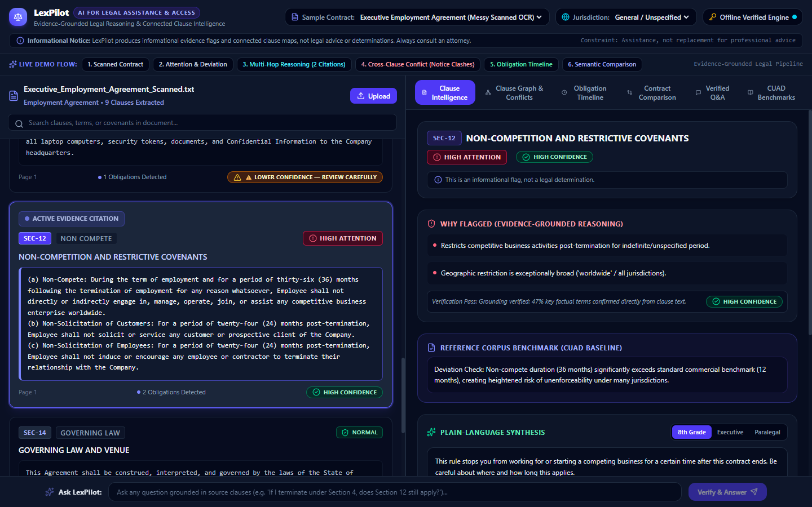
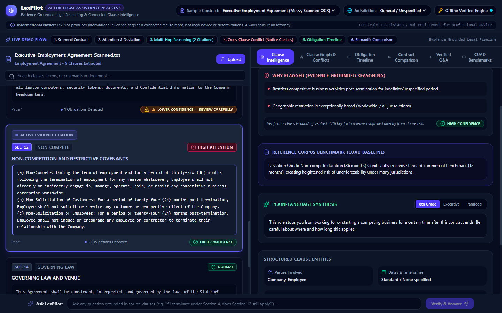
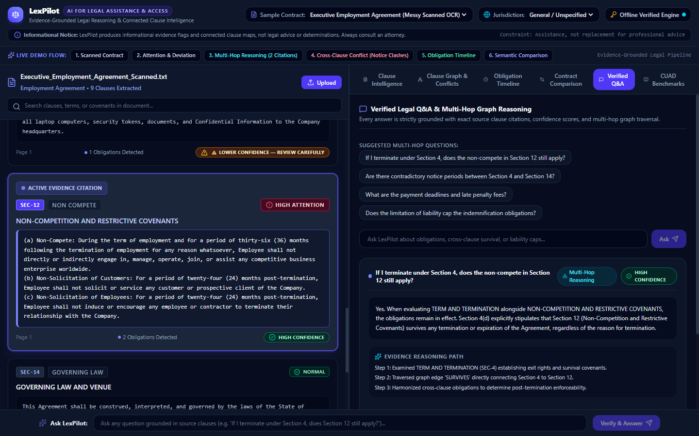
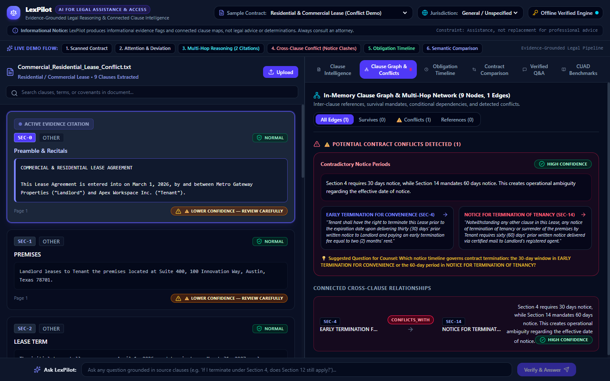

# ⚖️ LexPilot
### Evidence-Grounded Legal Reasoning Engine

**AI for Legal Assistance & Access — PromptWars: Virtual (Exclusive Edition)**

[](https://lex-pilot-phi.vercel.app/)
[](https://lex-pilot-phi.vercel.app/docs)
[](LICENSE)
[]()
[]()

**🌐 Live App:** https://lex-pilot-phi.vercel.app/  
**📚 API Docs:** https://lex-pilot-phi.vercel.app/docs  

---

## Table of Contents

- [The Problem](#the-problem)
- [What LexPilot Does](#what-lexpilot-does)
- [Why This Is Different](#why-this-is-different)
- [Architecture](#architecture)
- [Advanced Reasoning Engine](#advanced-reasoning-engine)
- [All Features](#all-features)
- [Live Demo Walkthrough](#live-demo-walkthrough)
- [Measured Results](#measured-results)
- [Security](#security)
- [Accessibility](#accessibility)
- [GenAI Usage](#genai-usage)
- [Safety Boundary](#safety-boundary)
- [Testing](#testing)
- [Running Locally](#running-locally)
- [Tech Stack](#tech-stack)

---

## The Problem

Legal documents — leases, employment contracts, NDAs, terms of service — are written in dense language most people can't confidently parse. Existing "AI contract reader" tools mostly summarize text or answer chat questions, but they:

- Give ungrounded answers with no traceable link back to the source clause
- Miss contradictions *between* clauses in the same document
- Treat comparison as a text diff instead of a legal-meaning diff
- Can't answer questions that require connecting multiple clauses together
- Sometimes imply a legal judgment without evidence or humility about what AI can actually determine

**The gap isn't summarization. It's trust.**

## What LexPilot Does

> LexPilot turns a legal document into a verified, connected map of clauses, obligations, attention points, conflicts, and next actions — where every AI claim is traceable to exact source text, scored for confidence, and reasoned over as a network of relationships rather than a flat pile of text.

Upload a contract. LexPilot extracts every clause into a structured representation, flags what needs attention with explicit reasoning, catches contradictions between sections, compares two contract versions semantically, and answers questions — including ones that require connecting multiple clauses — with exact citations and a confidence score attached to every claim.

---



---

## Why This Is Different

| Typical "AI contract reader" | LexPilot |
|---|---|
| Chunk + embed + chat | Structured clause graph with typed relationships |
| Ungrounded chatbot answers | Every claim carries a citation + confidence score |
| Flat similarity search | Query planner + graph traversal for multi-hop questions |
| "This seems risky" (vibes) | Deviation checks against a reference corpus |
| Generic conflict mentions | Typed conflicts (TEMPORAL, AMOUNT, SCOPE, etc.) with structured detail |
| Numeric "risk score" (overclaims) | Qualitative attention levels, explicitly labeled as informational only |
| Trusts LLM output directly | Backend validates every cited clause ID before showing an answer |

---

## Architecture

```
Document (PDF / Scan / Text)
        │
        ▼
  DOCUMENT PARSING           Layout-aware OCR, preserves section
                              headers, tables, signature blocks
        │
        ▼
   CLAUSE ENGINE             Segments into numbered clauses,
                              classifies into 10 legal categories
        │
        ▼
┌───────┴────────────────────────────┐
▼                                    ▼
CLAUSE GRAPH                  HYBRID RETRIEVAL
(NetworkX: REFERENCES,        (BM25 + semantic
 SURVIVES, CONFLICTS_WITH,     search over clauses)
 DEPENDS_ON edges)
└───────┬────────────────────────────┘
        ▼
  GEMINI ANALYSIS            Attention flags, plain-language
                              rewrites, conflict detection,
                              contract comparison, Q&A reasoning
        ▼
 VERIFICATION AGENT          Entailment check + confidence
                              scoring (High / Medium / Low) on
                              every generated claim
        ▼
  LEXPILOT REPORT            🔴 Attention  🟠 Review  🟢 Normal
                              Obligation timeline · Conflicts
                              Questions for your lawyer
                              Full evidence trail
```

**Split-pane UI:** the source document on the left, AI analysis on the right — click any citation and the document pane scrolls and highlights the exact source clause. No ungrounded text appears anywhere in the interface without a clickable citation behind it.

---

## Advanced Reasoning Engine

Beyond the core pipeline, LexPilot implements a formal reasoning architecture:

### 1. Legal Intermediate Representation (Legal-IR)
Every clause is converted into a canonical structured object — not just classified text:

```
LegalIRClause
├── identity        clause_id, section, page
├── semantic        category, parties, defined_terms
├── obligations      actor, action, object, deadline
├── conditions
├── exceptions
├── references       cross-clause citations
├── survival         does this clause survive termination?
└── evidence_span    exact page + character offset in source text
```
**Verified:** 100% clause conversion coverage (38/38 clauses across all sample documents), with character offsets confirmed to map exactly to source text.

### 2. Provenance Graph
Every answer traces a full reasoning chain, not just a final citation:

```
Question → Claim → Reasoning Step → Clause → Evidence Span → Page → Verification Result
```
Exposed in the UI as an expandable "Why this answer?" panel showing exactly which clauses, which exact character spans, and what verification result support each claim.

### 3. Query Planner + Graph Expansion
Before retrieval, the planner classifies question intent (e.g. `MULTI_HOP_SURVIVAL`, `CROSS_CLAUSE_CONFLICT`) and biases retrieval toward relevant clause categories, then expands the evidence set by walking one hop out on the clause graph — catching related clauses that similarity search alone would miss.

### 4. Typed Conflict Engine
Conflicts are classified into seven structured categories rather than a generic flag:

`TEMPORAL` · `AMOUNT` · `OBLIGATION` · `SCOPE` · `DEFINITION` · `SURVIVAL` · `CONDITIONAL`

Each detected conflict includes the specific attribute in dispute, both values, and both source clauses — verified dynamic (non-hardcoded) on synthetic test cases with novel numeric values.

### 5. Prompt-Injection Defense
Document text is always treated as untrusted data, never as instructions. Content is isolated within explicit delimiter boundaries, breakout attempts are sanitized, and an adversarial test suite confirms the system doesn't comply with embedded instructions like "ignore previous instructions" or "reveal your system prompt" — tested live against real payloads, not just in theory.

### 6. Structured Claim Validation
Gemini returns structured claims with explicit cited clause IDs. The backend validates every ID against the real parsed Legal-IR clause set *before* the claim reaches entailment checking or the UI — fabricated or hallucinated clause citations are rejected at the structural level.

### 7. Retrieval Evaluation Harness
An internal benchmark (`backend/eval_retrieval.py`) measures retrieval quality directly rather than asserting it. Current results on a curated internal set of 16 legal queries across 3 sample agreements:

| Metric | Result |
|---|---|
| Recall@1 | 100.0% |
| Recall@3 | 100.0% |
| Recall@5 (coverage) | 100.0% |
| Mean Reciprocal Rank | 1.0000 |
| Avg. retrieval latency | 0.70 ms |

*Scope note: this reflects performance on a targeted internal benchmark, not a general claim about retrieval at open-domain scale.*

---

## All Features

| # | Feature | What It Does |
|---|---------|---------------|
| 1 | **Smart Document Understanding** | Ingests native PDFs, scans, or text; handles OCR noise; preserves section hierarchy and signatures |
| 2 | **Clause Intelligence** | Classifies clauses into 10 categories (termination, payment, liability, confidentiality, indemnification, renewal, governing law, non-compete, notice, other) |
| 3 | **Attention Detection** | Qualitative attention levels (High / Review / Normal) with explicit, bulleted reasoning — never a numeric risk score |
| 4 | **Cross-Clause Reasoning** | Graph-based contradiction detection across the document |
| 5 | **Contract Comparison** | Semantic clause-to-clause alignment between two contract versions |
| 6 | **Verified Legal Q&A** | Every answer includes exact quotes, clause IDs, page numbers, and a confidence score |
| 7 | **Confidence-Weighted Verification** | Entailment check assigns High / Medium / Low confidence to every generated claim |
| 8 | **Reference Corpus Deviation Detection** | Flags clause language that deviates from standard template benchmarks |
| 9 | **Structured Obligation Timeline** | Chronological visual timeline of deadlines, grace periods, and payment dates |
| 10 | **Multi-Hop Graph Reasoning** | Answers questions requiring traversal across multiple connected clauses, with multiple source citations |

---

## Live Demo Walkthrough

Follow this 6-step path directly on [the live app](https://lex-pilot-phi.vercel.app):

1. **Ingest a messy scanned contract** — click *Scanned Contract* on the demo bar. Watch 9 structured clauses get extracted despite scan artifacts.
2. **Inspect attention & deviation** — select Section 12 (Non-Competition). See the **HIGH ATTENTION** badge and a deviation note: *"36-month non-compete significantly exceeds the 12-month standard benchmark."* Toggle reading levels (8th Grade / Executive / Paralegal).

   

3. **Multi-hop reasoning (the core proof)** — ask: *"If I terminate under Section 4, does the non-compete in Section 12 still apply?"* LexPilot traverses the graph edge `SEC-4 → SURVIVES → SEC-12` and returns a verified, two-citation answer. Click a citation — the document pane scrolls and highlights the exact source clause.

   

4. **Cross-clause conflict detection** — load the Commercial Lease sample. See Section 4 (30 days' notice) flagged against Section 14 (60 days' notice) as a `TEMPORAL` conflict, with an auto-generated "Question for Your Lawyer."

   

5. **Obligation timeline** — view all deadlines, payment dates, and grace periods on an interactive chronological track.
6. **Semantic contract comparison** — run MSA Version 1 vs. Revised Draft Version 2 and review material changes, additions, and deletions.

---

## Measured Results

All numbers below are actual measured output from the test suite and live verification scripts — none are estimated.

| Metric | Result | Verified By |
|---|---|---|
| Unit tests passing | 41/41 (100%) | `python -m unittest discover tests` |
| Pipeline features verified | 10/10 (100%) | `python backend/test_pipeline.py` |
| Live API checks passing | 11/11 (100%) | `python backend/verify_all_live.py` |
| Legal-IR clause coverage | 38/38 (100%) | `tests/test_legal_ir.py` |
| Character offset accuracy | 38/38 (100%) | Exact substring verification against source text |
| Retrieval Recall@5 | 100% | `backend/eval_retrieval.py` (16-query internal benchmark) |
| Retrieval MRR | 1.0000 | `backend/eval_retrieval.py` |
| Cold pipeline latency | 53.39 ms | `time.perf_counter()` full parse + graph build |
| Warm (cached) latency | 0.0145 ms | SHA-256 content-hash cache |
| Cache acceleration factor | 3,692.4× | `time.perf_counter()` cold vs. warm benchmark |
| Frontend bundle size | 326 KB (91.5 KB gzip) | `vite build` |
| Repository size | 2.93 MB | Well under the 10 MB submission limit |

---

## Security

- **HTTP security headers** on every response: `X-Content-Type-Options`, `X-Frame-Options`, `X-XSS-Protection`, `Strict-Transport-Security`, `Content-Security-Policy`, `Referrer-Policy`
- **Rate limiting** — sliding-window limiter per client IP (180 requests / 60 seconds), HTTP 429 with `Retry-After` on excess
- **Upload hardening** — 15 MB server-side size limit, file-type whitelist (`.pdf`, `.txt`, `.docx`, `.doc`), path-traversal-safe filename sanitization
- **Prompt-injection defense** — untrusted document content is isolated with explicit delimiters and tested against real adversarial payloads (see Advanced Reasoning Engine above)
- **No hardcoded secrets** — all credentials loaded via environment variables; `.env` excluded from version control; verified zero API keys or tokens present in the compiled frontend bundle
- **Structured claim validation** — every cited clause ID is checked against the real parsed document before an answer reaches the user, closing off hallucinated-citation attacks

---

## Accessibility

- Status badges use explicit text labels (`HIGH ATTENTION`, `HIGH CONFIDENCE`, etc.) rather than relying on color or emoji alone
- Semantic ARIA roles (`role="status"`, descriptive `aria-label`) on all status indicators
- WCAG AA contrast compliance across the interface
- Full keyboard navigation across all interactive cards, tabs, and controls

---

## GenAI Usage

**Google Gemini** is the primary generative AI service, used for:

- Plain-language interpretation of clauses at calibrated reading levels
- Attention-point generation with grounded, bulleted explanations
- Cross-clause and multi-hop reasoning across the clause graph
- Evidence-grounded question answering (refuses to answer without a citation)
- Semantic contract comparison between document versions

A separate **verification pass** checks every generated claim against the original source clauses and assigns a High / Medium / Low confidence score. If the Gemini API is unreachable, the system falls back to a deterministic offline legal reasoning engine rather than failing.

---

## Safety Boundary

- **Informational assistance only.** LexPilot does not provide legal advice or legal determinations, and is not a substitute for a qualified legal professional.
- **No numeric risk scores.** The product deliberately avoids misleading figures like "78% risk." It produces qualitative attention levels (High Attention / Review Recommended / Normal) backed by explicit, verifiable reasons.
- **Visible disclaimers** appear on every generated finding, conflict, and answer.

---

## Testing

```bash
# Modular unit test suite (41 tests)
python -m unittest discover tests

# End-to-end pipeline verification
python backend/test_pipeline.py

# Retrieval quality benchmark
python backend/eval_retrieval.py

# Live system verification (11 checks against a running server)
python backend/verify_all_live.py
```

Test coverage includes: layout-aware parsing & OCR noise handling, 10-category clause classification, Legal-IR conversion, entailment/confidence scoring, cross-clause conflict detection (all 7 types), prompt-injection resistance, structured claim validation, and efficiency/security hardening.

---

## Running Locally

```bash
python backend/run.py
```

- Web app: http://127.0.0.1:8000
- API docs: http://127.0.0.1:8000/docs

---

## Tech Stack

| Layer | Choice |
|---|---|
| LLM reasoning | Google Gemini |
| Retrieval | Hybrid BM25 + semantic embedding search |
| Clause graph | In-memory NetworkX graph |
| Backend | FastAPI |
| Frontend | React, split-pane UI |
| Deployment | Vercel |

---

## License

MIT — see [LICENSE](LICENSE).
